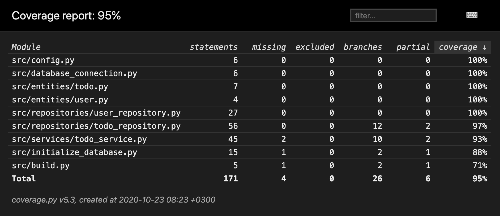
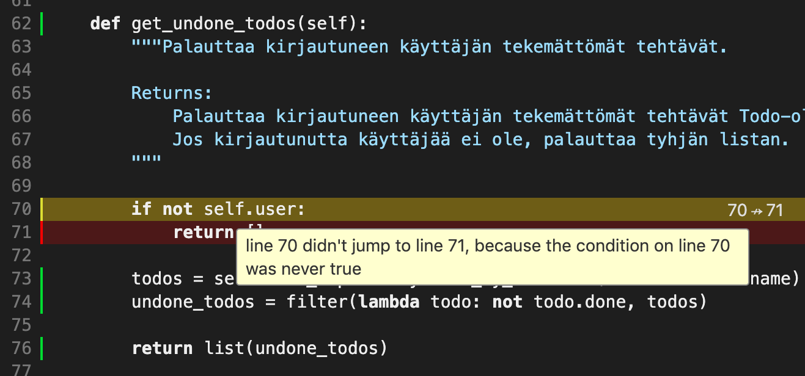

# Coverage ja testikattavuus

Olemme tyytyväisiä, uskomme että testitapauksia on nyt tarpeeksi. Onko tosiaan näin? Onneksi on olemassa työkaluja, joilla voidaan tarkastaa testien rivi- ja haarautumakattavuus. _Rivikattavuus_ mittaa mitä koodirivejä testien suorittaminen on tutkinut. Täydellinen rivikattavuuskaan ei tietenkään takaa että ohjelma toimii oikein, mutta on parempi kuin ei mitään. _Haarautumakattavuus_ taas mittaa mitä eri suoritushaaroja koodista on käyty läpi. Suoritushaaroilla tarkoitetaan esimerkiksi if-komentojen valintatilanteita.

Koska haarautumakattavuus antaa tyypillisesti realistisemman kuvan testien kattavuudesta, käytämme kurssilla sitä testikattavuuden mittarina.

## Testikattavuusraportti

Testikattavuuden kerääminen testien suorituksesta onnistuu [coverage](https://coverage.readthedocs.io/en/coverage-4.3.2/index.html)-työkalun avulla. Sen asentamisen projektin kehityksen aikaiseksi riippuvuudeksi onnistuu tuttuun tapaan komennolla:

```bash
poetry add coverage --dev
```

Testikattavuuden kerääminen `pytest`-komennolla suoritetuista testeistä onnistuu virtuaaliympäristössä komennolla:

```bash
coverage run --branch -m pytest
```

Komennon `--branch` flagillä pystymme keräämään testien [haarautumakattavuuden](https://coverage.readthedocs.io/en/coverage-4.3.2/branch.html). Komennon suorittamisen jälkeen voimme tulostaa komentoriville raportin kerätystä testikattavuudesta komennolla:

```bash
coverage report -m
```

Tulostuksesta huomaamme, että raportissa on suuri määrä projektin kannalta turhia tiedostoja. Voimme konfiguroida, mistä tiedostoista testikattavuutta kerätään projektin juurihakemiston _.coveragerc_-tiedostossa. Jos haluamme sisällyttää testikattavuuteen vain projektin _src_-hakemiston, on konfiguraatio seuraava:

```
[run]
source = src
```

## Tiedostojen jättäminen raportin ulkopuolelle

Voimme jättää testikattavuuden ulkopuolelle tiedostoja ja hakemistoja. Järkevää voisi olla esimerkiksi jättää testihakemisto, käyttöliittymän koodin hakemisto ja _src/index.py_-tiedosto testikattavuuden ulkopuolle. Tämä onnistuu seuraavalla muutoksella _.coveragerc_-tiedostoon:

```
[run]
source = src
omit = src/tests/**,src/ui/**,src/index.py
```

Nyt komentojen `coverage run --branch -m pytest` ja `coverage report -m` suorittaminen sisällyttää vain haluamamme _src_-hakemiston tiedostot.

## Visuaalisempi testikattavuusraportti

Komentoriviltä luettavaa raporttia selkeämmän esitysmuodon voi generoida komennolla:

```bash
coverage html
```

Komennon suorittaminen luo projektin juurihakemistoon hakemiston _htmlcov_. Raporttia voi katsoa selaimessa avaamalla hakemiston tiedoston _index.html_ selaimen kautta. Selaimessa aukeava raportti näyttää kutakuinkin seuraavalta:



Raportista näemme, että koko koodin haaraumakattavuus on 95%. Yksittäisen tiedoston haaraumakattavuuden näemme taulukon "coverage"-sarakkeesta. Jos klikkaamme taulukosta yksittäisen tiedoston nimeä aukeaa tiedoston koodi ja testien siinä kattamat haarat. Katetut haarat näkyvät vihreinä palkkeina rivinumeron vieressä. Haarat, joita ei ole katettu ollenkaan, on korostettu punaisella värillä. Sen sijaan, jos haara on osittain katettu, se on korostettu keltaisella värillä. Viemällä hiiri rivin päälle, nähdään tarkempi selitys, miksi haaraa ei ole täysin katettu:



Kuvan tilanteessa if-ehto ei koskaan saanut arvoa `True`, joten kyseistä haaraa ei testeissä käsitelty.

## Testikattavuusraportin generoimiselle oma tehtävä

[Invoke-ohjeessa](./invoke.md) ohjeistetaan, miten projektille voi määritellä uudelleenkäytettäviä tehtäviä ja miten niitä voi suorittaa komentoriviltä. Määritellään testikattavuuden keräämiselle ja raportin generoimiselle omat tehtävät, `coverage` ja `coverage-report`. Tämä onnistuu määritellemällä tehtävät projektin juurihakemiston _tasks.py_-tiedostossa:

```python
from invoke import task

@task
def coverage(ctx):
    ctx.run("coverage run --branch -m pytest")

@task(coverage)
def coverage_report(ctx):
    ctx.run("coverage html")

# ...
```

Nyt testikattavuuden kerääminen ja raportin generointi pitäisi onnistua komennolla:

```bash
poetry run invoke coverage-report
```
